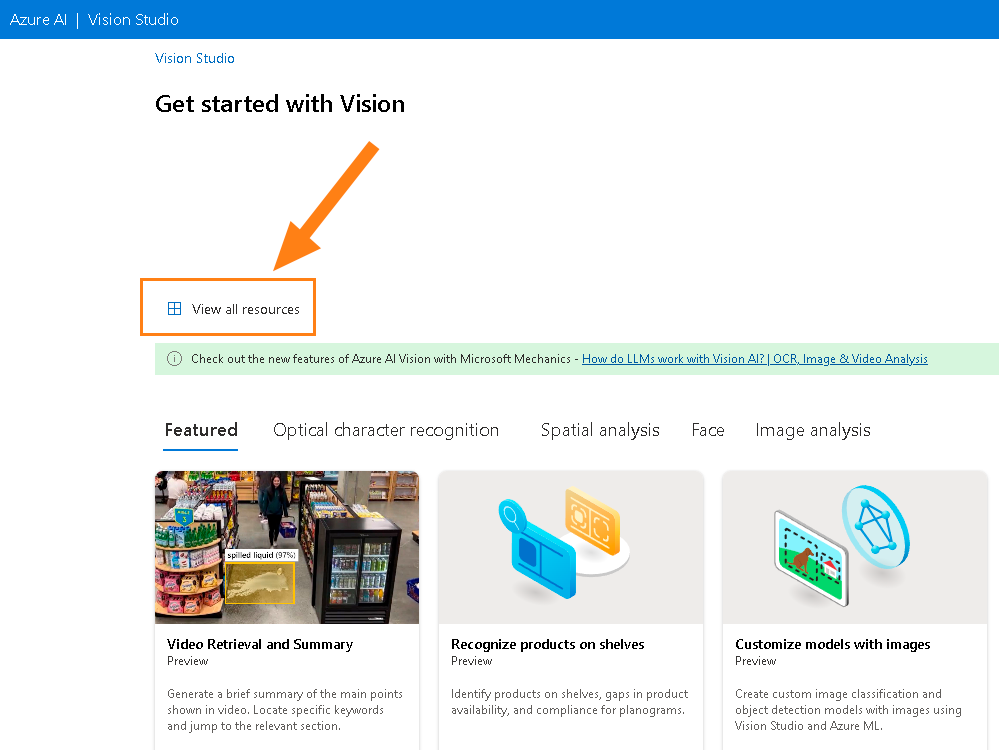
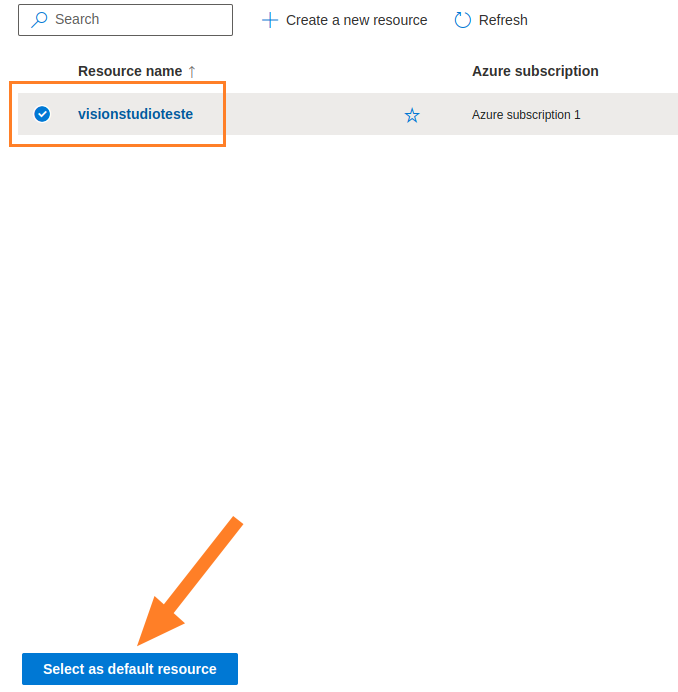
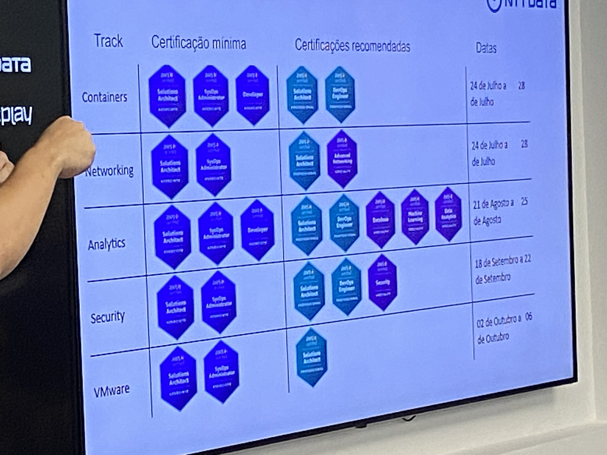
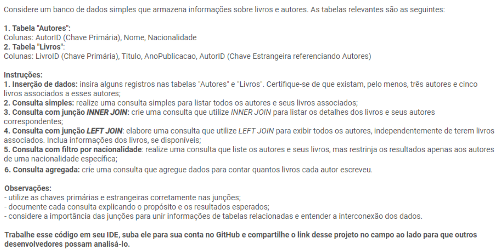
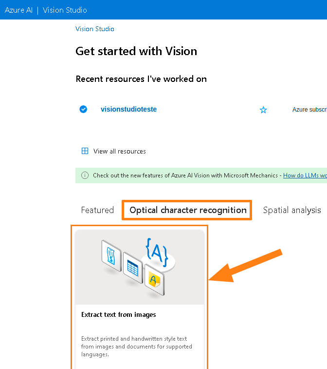
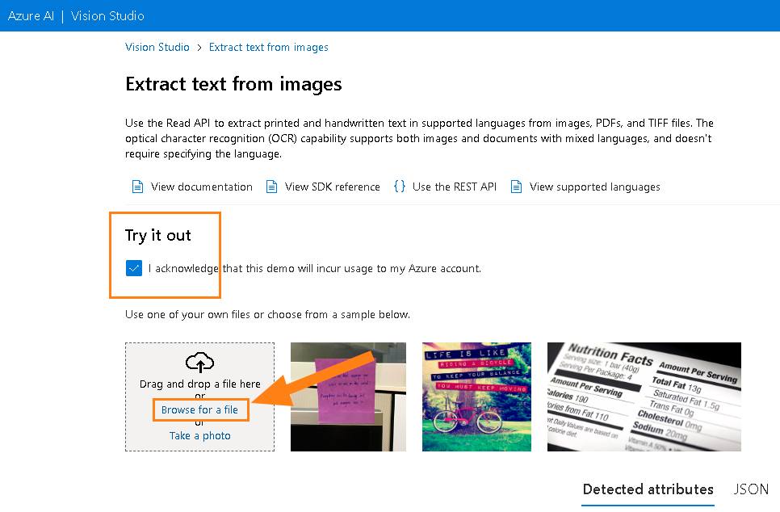
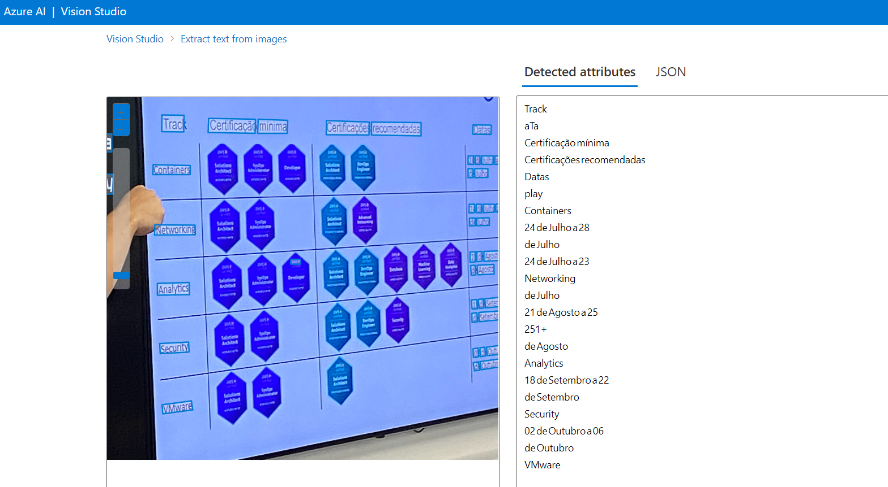

# *Reconhecimento Facial e transformação de imagens em Dados no Azure ML*

## Objetido 

1. Crie um novo repositório no github com um nome a sua preferência
2. Crie uma pasta chamada 'inputs' e salve as imagens que você utilizou
3. Crie uma pasta chamado 'output' e salve os resultados de reconhecimento de texto nessas imagens
4. Crie um arquivo chamado readme.md , deixe alguns prints descreva o processo, alguns insights e possibilidades que você aprendeu durante o conteúdo.
5. Compartilhe conosco o link desse repositório através do botão 'entregar projeto'

## Processo 
Inteligencia Artificial do Azure

## Configurando recurso

## Vision Studio

### Foto 

### Leitura de imagem

 

### OCR do Azure AI

### Ambiente

### Leitura de imagem

## Conclusão 

OCR do Azure (Serviço de Reconhecimento Óptico de Caracteres da Microsoft Azure) pode variar com base na experiência e nas necessidades específicas de cada usuário. No entanto, geralmente, o OCR do Azure é reconhecido por suas capacidades avançadas de reconhecimento de texto em imagens e documentos.

Principais vantagens do OCR do Azure:

Precisão: O OCR do Azure geralmente oferece alta precisão na extração de texto de imagens e documentos.

Suporte a vários idiomas: É capaz de reconhecer texto em uma variedade de idiomas, o que o torna útil para usuários internacionais.

Facilidade de uso: Integra-se facilmente a aplicativos e serviços da Microsoft Azure e oferece uma API robusta para integração personalizada.

Escalabilidade: Pode lidar com volumes variáveis de processamento de texto, tornando-o adequado para aplicações com demandas de escala variável.

Atualizações regulares: A Microsoft geralmente atualiza e aprimora seu OCR do Azure para melhorar a precisão e a capacidade de reconhecimento.

Porém, é importante notar que a eficácia do OCR do Azure pode depender de fatores como a qualidade da imagem, o layout do texto e o idioma. Em alguns casos, pode ser necessário ajustar configurações ou usar técnicas de pré-processamento para obter os melhores resultados.

Em resumo, o OCR do Azure é uma ferramenta poderosa para reconhecimento de texto em imagens e documentos, com uma variedade de recursos e uma reputação de precisão.

